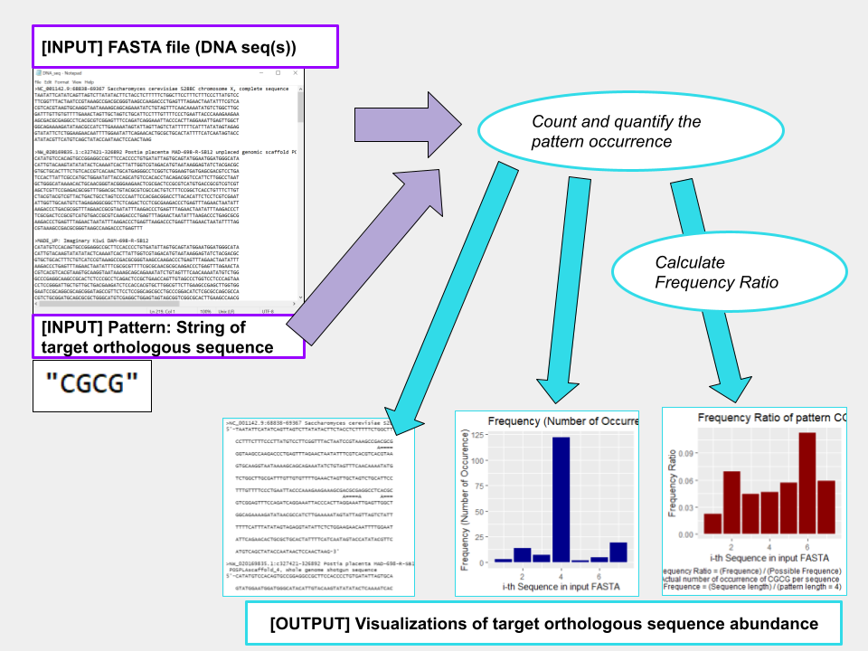

<!-- README.md is generated from README.Rmd. Please edit that file -->

```{r, include = FALSE}
knitr::opts_chunk$set(
  collapse = TRUE,
  comment = "#>",
  fig.path = "man/figures/README-",
  out.width = "100%"
)
```

# orthoVisualizer

Rpackage orthoVisualizer allows identification/annotation/quantification of user-specified ortholog subsequence within each of the DNA sequences provided in a multi-FASTA file.

## Description

`orthoVisualizer` is a R package to explore the abundance of orthologous gene subsequence across multiple DNA sequences, and provide annotations/visualizations for intuitive analysis. Modern orthologue detection tools specialize in comparing two sequences (species) at a time and refer to database to look for corresponding orthologues. However, such tools will not work with newly-discovered sequences that are yet to be recorded to the database. `orthoVisualizer` addresses this issue by allowing the user to specify which particular subsequence to look for in multiple of species (sequences) at once. Such preliminary analysis and getting the overview of abundance among multiple sequences will give researchers the idea of which species to look into (those with higher abundance ratio) for researching their target orthologue, which is an essential step in orthologous gene / motif exploration. 

The `orthoVisualizer` package was developed using `R version 4.1.1 (2021-08-10)`, `Platform: x86_64-w64-mingw32` and `Running under: mingw32`.

## Installation

To install the latest version of the package:
``` r
require("devtools")
devtools::install_github("karynkomatsu/orthoVisualizer", build_vignettes = TRUE)
library("orthoVisualizer")
```
Shiny app: Under Construction


## Overview

``` r
ls("package:orthoVisualizer")
data(package = "orthoVisualizer") 
browseVignettes("orthoVisualizer")
```
`orthoVisualizer` contains 4 functions for exploratory analysis of orthologous gene/motif occurrence in a multi-FASTA file. There are 3 main components to this package. "Annotation" (*annotateSeq*), "Quantification" (*quantSeq*), and "Visualization" (*freqSeq*, *freqRatioSeq*). 

The *annotateSeq* function annotates the occurrence of target subsequence (orthologous gene/motif) in each DNA sequence. Specifically, it prints all lines of DNA sequences in FASTA file and display an underline of "X====Y" for each subsequence occurrence. "=" are the letter that matches the subsequence, and "X" and "Y" are nucleotide that comes before / after the subseqence, correspondingly. The *quantSeq* returns tibble with quantity values related to the subsequence occurrence for each of the DNA sequences in FASTA file. (ex. "How many times the subsequence occurred"). *freqSeq* is a function that generates barplot showing frequency of subsequence occurrence, and each bar represents DNA sequence in FASTA file (ie. If there were 5 sequences in FASTA file, there would be 5 bars where first sequence in the FASTA is leftmost bar, second sequence in the FASTA is second-left bar...). The *freqRatioSeq* function works similar, except each bar height represents the frequency ratio ("Number of occurrence" / "Length of sequence over Length of target subsequence"). Refer to package vignettes for more details. An overview of the package is illustrated below. 




## Contributions

The author of the package is Karyn Komatsu. All functions makes use of `biocManager` R package to install Bioconductor packages and `BiocGenerics` to re-format strings of DNA sequence in FASTA file for easier analysis. The *annotateSeq* function makes use of substring function from `Biostrings` R package to manipulate large strings (DNA sequences) for human-friendly, legible presentation of sequences. The *quantSeq* function uses tibble function from `tibble` R package to create a tibble object containing quantity data of orthologue subsequence abundance. The *freqSeq* and *freqRatioSeq* functions utilize pipe operator from `magrittr` R package and mutate function from `dplyr` function for manipulating data to allow better visualization. Many functions, such as ggplot, aes, geom_col, labs functions were used from `ggplot2` and `tidyverse` R packages for generating visualization of ortholog sequence abundance. The frequency ratio used in generation of bar plot for *freqRatioSeq* function are calculated using a function written by the author.


## References

Bache, SM., et al. A Forward-Pipe Operator for R [R Package Magrittr Version 2.0.3]. *The Comprehensive R Archive Network (CRAN)*, 30 Mar. 2022, https://cran.r-project.org/web/packages/magrittr/index.html. 

Hashim, FA., et al. (2019) Review of Different Sequence Motif Finding Algorithms. *Avicenna Journal of Medical Biotechnology*, U.S. National Library of Medicine, https://pubmed.ncbi.nlm.nih.gov/31057715/. 

Huber, W. et al. (2015). Orchestrating high-throughput genomic analysis with Bioconductor. *Nature Methods*, 12(2), 115–121. http://www.nature.com/nmeth/journal/v12/n2/full/nmeth.3252.html.

Morgan, M. Access the Bioconductor Project Package Repository [R Package BiocManager Version 1.30.19]. *The Comprehensive R Archive Network (CRAN)*, 25 Oct. 2022, https://cran.r-project.org/web/packages/BiocManager/index.html. 

Müller, K., et al. In-Line Documentation for R [R Package Roxygen2 Version 7.2.2]. *The Comprehensive R Archive Network (CRAN)*, 22 July. 2022, https://cran.r-project.org/web/packages/roxygen2/index.html. 

Pagès H., et al. (2022). Biostrings: Efficient manipulation of biological strings. *R package version 2.66.0*, https://bioconductor.org/packages/Biostrings.

Wickham, H. and Bryan, J. (2019). *R Packages* (2nd edition). Newton, Massachusetts: O'Reilly Media. https://r-pkgs.org/

Wickham, H., et al. A Grammar of Data Manipulation [R Package Dplyr Version 1.0.10]. *The Comprehensive R Archive Network (CRAN)*, 1 Sept. 2022, https://cran.r-project.org/web/packages/dplyr/index.html. 

Wickham, H. et al Create Elegant Data Visualisations Using the Grammar of Graphics [R Package GGPLOT2 Version 3.4.0]. *The Comprehensive R Archive Network (CRAN)*, 4 Nov. 2022, https://cran.r-project.org/web/packages/ggplot2/index.html. 

Wickham, H., et al. In-Line Documentation for R [R Package Roxygen2 Version 7.2.2]. *The Comprehensive R Archive Network (CRAN*), 11 Nov. 2022, https://cran.r-project.org/web/packages/roxygen2/index.html. 

Wickham, H. Easily Install and Load the 'Tidyverse' [R Package Tidyverse Version 1.3.2]. *The Comprehensive R Archive Network (CRAN)*, 18 July 2022, https://cran.r-project.org/web/packages/tidyverse/index.html. 


## Acknowledgements

This package was developed as part of an assessment for 2019-2022 BCB410H: Applied Bioinformatics course at the University of Toronto, Toronto, CANADA. `orthoVisualizer` welcomes issues, enhancement requests, and other contributions. To submit an issue, use the [GitHub issues](https://github.com/karynkomatsu/orthoVisualizer/issues). Many thanks to those who provided feedback to improve this package.
