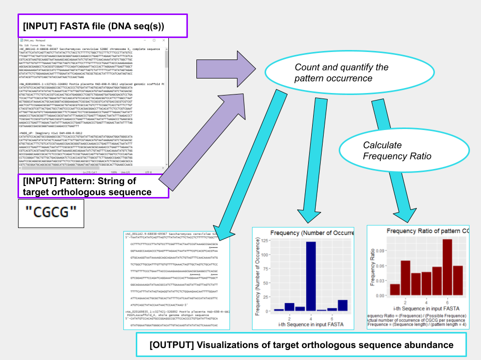

```{r setup, include=FALSE}
library(knitr)
opts_chunk$set(fig.align = "center", 
               out.width = "90%",
               fig.width = 6, fig.height = 5.5,
               dev.args=list(pointsize=10),
               par = TRUE, # needed for setting hook 
               collapse = TRUE, # collapse input & ouput code in chunks
               warning = FALSE)
knit_hooks$set(par = function(before, options, envir)
  { if(before && options$fig.show != "none") 
       par(family = "sans", mar=c(4.1,4.1,1.1,1.1), mgp=c(3,1,0), tcl=-0.5)
})
set.seed(1) # for exact reproducibility
```
       
## Introduction

`orthoVisualizer` is R package to explore the abundance of orthologous gene subsequence across multiple DNA sequences, and provide annotations/visualizations for intuitive analysis. Modern orthologue detection tools specialize in comparing two sequences (species) at a time and refer to database to look for corresponding orthologues. However, such tools will not work with newly-discovered sequences that are yet to be recorded to the database. `orthoVisualizer` addresses this issue by allowing the user to specify which particular subsequence to look for in multiple of species (sequences) at once. Such preliminary analysis and getting the overview of abundance among multiple sequences will give researchers the idea of which species to look into (those with higher abundance ratio) for researching their target orthologue, which is an essential step in orthologous gene / motif exploration. **This document gives a tour of orthoVisualizer (version 0.1.0)**. It was written in R Markdown, using the [knitr](https://cran.r-project.org/package=knitr) package for production. See `help(package = "orthoVisualizer")` for further details. 

To download **orthoVisualizer**, use the following commands:

``` r
require("devtools")
install_github("karynkomatsu/orthoVisualizer", build_vignettes = TRUE)
library("orthoVisualizer")
```
To list all sample functions available in the package:
``` r
ls("package:orthoVisualizer")
```

<br>

## Components

Components are as following.

<div style="text-align:center">

<div style="text-align:left">

### Functions

* The **annotateSeq** function prints each DNA sequence in inputted FASTA file along with annoation of where the user-inputted substring (which should be some orthologous gene or motif).

annotateSeq() Example:

``` r
#Get data inside inst/extdata of the orthoVisualizer package
placenta_path <- system.file("extdata", "P_Placenta_seq.fasta", package = "orthoVisualizer")
annotateSeq(fastaPath=placenta_path, pattern="CGCG")
#Returns invisible NULL and prints sequences along with annotations.
```

* The **quantSeq** function finds user-inputted patterns in each of the sequences recorded in the inputted FASTA file, then returns tibble containing relevant quantity values.

quantSeq() Example:

```r
#Get data inside inst/extdata of the orthoVisualizer package
DNA_path <- system.file("extdata", "DNA_seq.fasta", package = "orthoVisualizer")
DNA_df <- quantSeq(fastaPath=DNA_path, pattern="CGCG")
DNA_df
#Returns a tibble with 5 columns related to pattern "CGCG" matches.
```

* The **freqSeq** function generates barplot where each bar represents a sequence in input FASTA file, and height represents frequency (number of occurrence) of the pattern (in the example below: "CGCG") for the corresponding sequence.

freqSeq() Example:

```r
#Get data inside inst/extdata of the orthoVisualizer package
DNA_path <- system.file("extdata", "DNA_seq.fasta", package = "orthoVisualizer")
freqSeq(fastaPath=DNA_path, pattern="CGCG")

#Returns AND displays a barplot with height being number of occurrences of 
#pattern, and each bars representing each sequence.
```

* The **freqRatioSeq** function generates barplot where each bar represents a sequence in input FASTA file, and height represents frequency ratio of the pattern (in the example below: "CGCG") for the corresponding sequence. 
$\text{Frequency Ratio} = \frac{\text{Frequency (ie. Number of Occurrence)}}{\frac{\text{Length of Sequence}}{\text{Length of Pattern}}}$

freqRatioSeq() Example:

For this example, since we are looking at "CGCG", a 4 character pattern, if a sequence has 12 nucleotides and has one occurrence of "CGCG", we get: $\text{Frequency Ratio} = \frac{\text{Frequency (ie. Number of Occurrence)}}{\frac{\text{Length of Sequence}}{\text{Length of Pattern}}} = \frac{1}{\frac{12}{4}} = \frac{1}{3}$

```r
#Get data inside inst/extdata of the orthoVisualizer package
DNA_path <- system.file("extdata", "DNA_seq.fasta", package = "orthoVisualizer")
freqRatioSeq(fastaPath=DNA_path, pattern="CGCG")

#Returns AND displays a barplot with height being frequency ratio of 
#pattern, and each bars representing each sequence.
```

<br>

<div style="text-align:left">

## Package References

[Komatsu, K. (2022) orthoVisualizer: An Example R Package For
  BCB410H. Unpublished.](https://github.com/karynkomatsu/orthoVisualizer)

<br>

## Other References

Bache, SM., et al. A Forward-Pipe Operator for R [R Package Magrittr Version 2.0.3]. *The Comprehensive R Archive Network (CRAN)*, 30 Mar. 2022, https://cran.r-project.org/web/packages/magrittr/index.html. 

Google Drawings. (2022). Image created by Komatsu, K. Retrieved November 14, 2022, from https://docs.google.com/drawings/

Hashim, FA., et al. (2019) Review of Different Sequence Motif Finding Algorithms. *Avicenna Journal of Medical Biotechnology*, U.S. National Library of Medicine, https://pubmed.ncbi.nlm.nih.gov/31057715/. 

Muller, K., et al. In-Line Documentation for R [R Package Roxygen2 Version 7.2.2]. *The Comprehensive R Archive Network (CRAN)*, 22 July. 2022, https://cran.r-project.org/web/packages/roxygen2/index.html. 

Steipe, Boris. BCH441 Integrator Unit: Genome Annotation. *Integrator Unit: Genome Annotation*, 2021, http://steipe.biochemistry.utoronto.ca/bio/ABC-INT-Genome_annotation.html. 

Pagès H., et al. (2022). Biostrings: Efficient manipulation of biological strings. *R package version 2.66.0*, https://bioconductor.org/packages/Biostrings.

R Core Team (2020). R: A language and environment for statistical computing. *R Foundation for Statistical Computing*, Vienna, Austria. https://www.R-project.org/

Wickham, H. and Bryan, J. (2019). *R Packages* (2nd edition). Newton, Massachusetts: O'Reilly Media. https://r-pkgs.org/

Wickham, H., et al. A Grammar of Data Manipulation [R Package Dplyr Version 1.0.10]. *The Comprehensive R Archive Network (CRAN)*, 1 Sept. 2022, https://cran.r-project.org/web/packages/dplyr/index.html. 

Wickham, H. et al Create Elegant Data Visualisations Using the Grammar of Graphics [R Package GGPLOT2 Version 3.4.0]. *The Comprehensive R Archive Network (CRAN)*, 4 Nov. 2022, https://cran.r-project.org/web/packages/ggplot2/index.html. 

Wickham, H., et al. In-Line Documentation for R [R Package Roxygen2 Version 7.2.2]. *The Comprehensive R Archive Network (CRAN*), 11 Nov. 2022, https://cran.r-project.org/web/packages/roxygen2/index.html. 

----

```{r}
sessionInfo()
```
